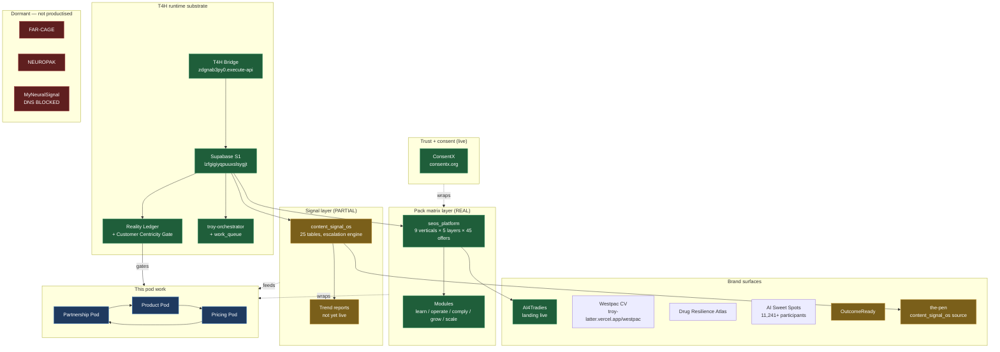

# ECOSYSTEM MAP — internal portfolio + external mirror

> One Mermaid diagram, one table. How the pod work relates to other T4H entities and how each piece maps to the outside world.

## Internal portfolio map

## External landscape mirror

```mermaid
graph TB
    subgraph T4H["T4H internal"]
        T_SEOS[seos_platform<br/>pack matrix]
        T_CSO[content_signal_os<br/>signal engine]
        T_CX[ConsentX]
        T_CCG[Customer Centricity Gate]
        T_DRA[Drug Resilience Atlas]
    end

    subgraph EXT_COMPLY["External — compliance packs"]
        VAN[Vanta]
        DRA_X[Drata]
        KAR[Karbon]
        SVC[ServiceM8]
        LUM[Lumary]
    end

    subgraph EXT_SIGNAL["External — signal / process"]
        CEL[Celonis]
        UIP[UiPath PM]
        GLE[Glean]
        HEB[Hebbia]
        PEN[Pendo]
        MIX[Mixpanel]
    end

    subgraph EXT_CONSENT["External — consent / trust"]
        OT[OneTrust]
        TT[TrustArc]
        IUB[Iubenda]
    end

    subgraph EXT_GOV["External — governance methodology"]
        NONE[No direct analogue]
    end

    T_SEOS -.->|competes / partners| VAN
    T_SEOS -.-> DRA_X
    T_SEOS -.-> KAR
    T_SEOS -.-> SVC
    T_SEOS -.-> LUM

    T_CSO -.-> CEL
    T_CSO -.-> UIP
    T_CSO -.-> GLE
    T_CSO -.-> HEB
    T_CSO -.->|complementary| PEN
    T_CSO -.->|complementary| MIX

    T_CX -.->|competes / partners| OT
    T_CX -.-> TT
    T_CX -.-> IUB

    T_CCG -.->|publishable IP| NONE

    classDef t4h fill:#1f3a5f,stroke:#3e7ec8,color:#fff
    classDef ext fill:#3a3a3a,stroke:#7a7a7a,color:#fff
    classDef gap fill:#2d4a1f,stroke:#5e8f2d,color:#fff

    class T_SEOS,T_CSO,T_CX,T_CCG,T_DRA t4h
    class VAN,DRA_X,KAR,SVC,LUM,CEL,UIP,GLE,HEB,PEN,MIX,OT,TT,IUB ext
    class NONE gap
```

## Internal cross-portfolio relationships table

| T4H entity | Group | Status | Relevant to pods? | How |
|---|---|---|---|---|
| `seos_platform` | Products | REAL | ✅ Core | Pack matrix substrate — Product Pod owns hardening |
| `content_signal_os` | Products (via TML-4PM/the-pen) | PARTIAL | ✅ Core | Signal engine — required for Pricing Pod Model C |
| `ConsentX` (`consentx.org`) | CORE | live | ✅ Direct | Consent wrapper for white-label onboarding |
| `Customer Centricity Gate` | t4h-research-hub doctrine | REAL | ✅ Gating | All pod artifacts pass through this gate |
| `AI Sweet Spots` | RESEARCH | REAL | 🟡 Adjacent | Provides AI-readiness diagnostic; pricing input |
| `OutcomeReady` | Products | PARTIAL | 🟡 Adjacent | Fractional-CTO model; complements Pricing Model B |
| `MAAT` | CORE | REAL | 🟡 Internal | Provides margin / cost data for Pricing Pod |
| `Drug Resilience Atlas` | MISSION | REAL | ❌ Out of scope | Separate programme, separate licensing |
| `Buddy Platform V2` | Products | PARTIAL | ❌ Adjacent only | Mental health vertical — own gating |
| `MyNeuralSignal` | GC-BAT | DNS BLOCKED | ❌ Blocked | Brand unusable until DNS fixed |
| `FAR-CAGE` | GC-BAT | `is_active=false` | ❌ Dormant | Narrative entity — do not productise |
| `NEUROPAK` | Products | `is_active=false` | ❌ Dormant | Re-evaluate post-pod outcome |
| `Doolittles by Synal` | Products | PARTIAL | ❌ Adjacent | Cognitive runtime; could feed `content_signal_os` later |
| `SmartPark` | Products | PARTIAL | ❌ Separate | Parking domain — different vertical |
| `Westpac CV` | PERSONAL | PARTIAL | ❌ Personal | Job application, not commercial |
| `t4h-research-hub` | Governance | REAL | ✅ Host | This folder lives here |
| `the-pen` | Infrastructure | live | ✅ Source | `content_signal_os` schema lives here |
| `IP asset registry` (251+ assets, ~$8.84M) | CORE | REAL | 🟡 Reference | Pricing Pod input for asset valuation |

## What this map clarifies

1. **The pods sit between substrate and brand surfaces.** They don't extend the substrate; they decide how to wrap it.
2. **Dormant entities (`FAR-CAGE`, `NEUROPAK`, `MyNeuralSignal`) stay out.** If pods recommend resurrection, that becomes its own registry promotion with its own gate.
3. **The Customer Centricity Gate is T4H's only category-defining IP with no external analogue.** Worth publishing as open methodology to anchor T4H's profile.
4. **`Drug Resilience Atlas` is explicitly out of scope** — different programme, different counsel, different licensing constraints.
5. **Cross-pollination is one-way only for ATO-bound assets.** `t4h-research-hub` hosts this folder under `08_BUSINESS_GATES/signal-pack-pods/`, but pod work does not consume ATO evidence.

## Decisions implied by this map

- Lock the diagrams as canonical. Update only via dated commit.
- Re-render quarterly; anchor against `t4h_business_registry` at render time.
- Surface the dormant / blocked items on every pod check-in so they don't drift.
